# ECG-MIT BIH: Sub-50 KB Inter-Patient Arrhythmia Classification

A lightweight ECG arrhythmia classification framework evaluated on the **MIT-BIH Arrhythmia Database** using a strict inter-patient evaluation protocol, DCT-based spectral representation, Frequency Discovery Network (FDN) feature selection, Sample-Adaptive Spectral Attention (SASA), and INT8 ONNX deployment.

The primary evaluation follows the **AAMI 5-class formulation** with a patient-independent **DS1 → DS2** split. Additional experiments cover 3-class and 4-class classification, cross-database evaluation, quantization, robustness, and ablation studies.

---

## Overview

Automated ECG beat classification is affected by both inter-patient variation and severe class imbalance. This work investigates a compact spectral representation and lightweight neural architectures under a strict patient-independent evaluation setting.

The experiments cover:

* ECG signal preprocessing and beat segmentation
* AAMI 5-class arrhythmia classification
* DCT-based spectral representation
* Frequency Discovery Network (FDN) for selecting 40 DCT coefficients
* Lightweight 1D-CNN classification
* Sample-Adaptive Spectral Attention (SASA)
* FP32 and INT8 ONNX deployment
* Inter-patient DS1 → DS2 evaluation
* Cross-database evaluation
* 3-class and 4-class analyses
* Ablation and robustness experiments

The deployment experiments target a model footprint below **50 KB**.

---

## Dataset

The primary dataset is the **MIT-BIH Arrhythmia Database**.

### Signal Configuration

* **Lead:** MLII
* **Sampling frequency:** 360 Hz
* **Beat-centered window:** 250 samples
* **Window:** 90 samples before and 160 samples after the annotated R-peak
* **Bandpass filter:** 3rd-order Butterworth, 0.5–40 Hz
* **Notch filter:** 60 Hz, Q = 30

### AAMI 5-Class Mapping

| Class | Description                            |
| :---: | -------------------------------------- |
| **N** | Normal and related beats               |
| **S** | Supraventricular ectopic beats         |
| **V** | Ventricular ectopic beats              |
| **F** | Fusion beats                           |
| **Q** | Unknown / paced / unclassifiable beats |

### ECG Beat Visualization

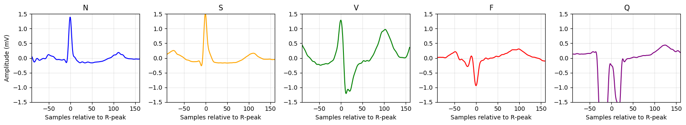

---

## Signal Processing

ECG recordings are filtered and segmented into beat-centered windows around annotated R-peaks.

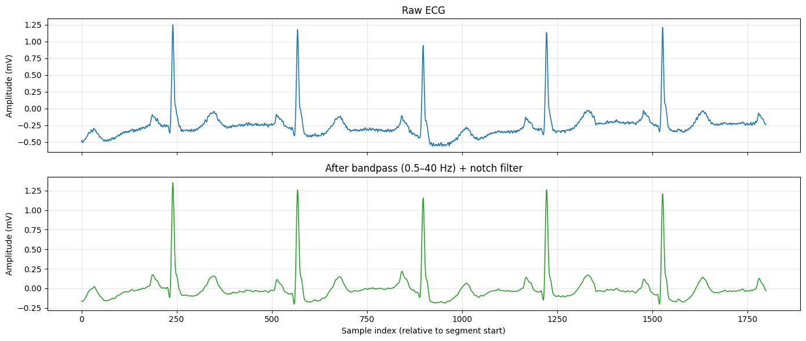

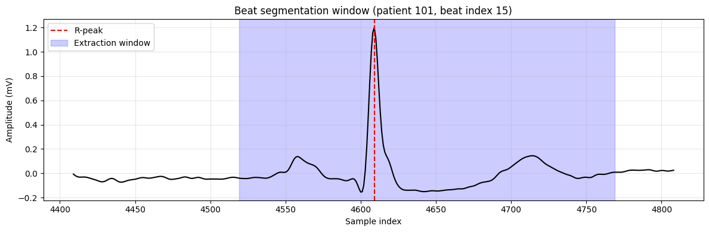

The processing configuration uses a 250-sample window centered around the annotated R-peak. The resulting beat-level signals are subsequently represented in the DCT domain.

---

## Evaluation Protocol

The primary experiment follows a strict **inter-patient** evaluation protocol.

```text
MIT-BIH Arrhythmia Database
            │
            ├── DS1
            │    └── Training / Validation
            │
            └── DS2
                 └── Held-out Testing
```

The split follows the de Chazal inter-patient protocol, with patients in the held-out test set separated from those used for training and validation.

### Primary Evaluation

| Setting               | Configuration       |
| --------------------- | ------------------- |
| Training / Validation | DS1                 |
| Testing               | DS2                 |
| Classification        | AAMI 5-class        |
| Evaluation            | Patient-independent |
| Metrics               | Accuracy, Macro-F1  |
| Repeated runs         | 5 seeds             |

Because of the class imbalance, **Macro-F1** is reported alongside Accuracy to reflect performance across all classes rather than the majority class alone.

---

## Class Imbalance and Augmentation

### Class Weighting

Inverse-square-root-of-frequency weighting is used to reduce the influence of the majority classes during training.

### Loss Function

The classification models use **Focal Loss** together with class weighting.

### Data Augmentation

No SMOTE or synthetic interpolation is used.

Minority-class augmentation is performed through Gaussian-noise duplication of real minority beats.

### Leakage Control

Patient-dependent features, including patient-normalized RR information, are computed within individual records to avoid using information from other patients.

---

# Frequency-Domain Representation

The beat-level ECG signals are transformed using the **Discrete Cosine Transform (DCT)** to obtain a compact spectral representation.

The resulting representation contains **61 DCT coefficients**. A smaller subset is then selected for the lightweight models.

---

## Frequency Discovery Network — 40 DCT Coefficients

The **Frequency Discovery Network (FDN)** is used to identify a compact set of DCT coefficients.

The resulting representation contains **40 selected DCT coefficients**.

### Selected DCT Indices

```text
[0, 1, 2, 3, 4, 5, 6, 7, 8, 9,
 10, 12, 13, 15, 16, 17, 18, 19, 21, 22,
 23, 26, 27, 28, 29, 30, 31, 32, 33, 34,
 35, 40, 41, 42, 45, 50, 52, 55, 58, 60]
```

The FDN-selected coefficients are compared with a fixed selection of the first 40 DCT bins.

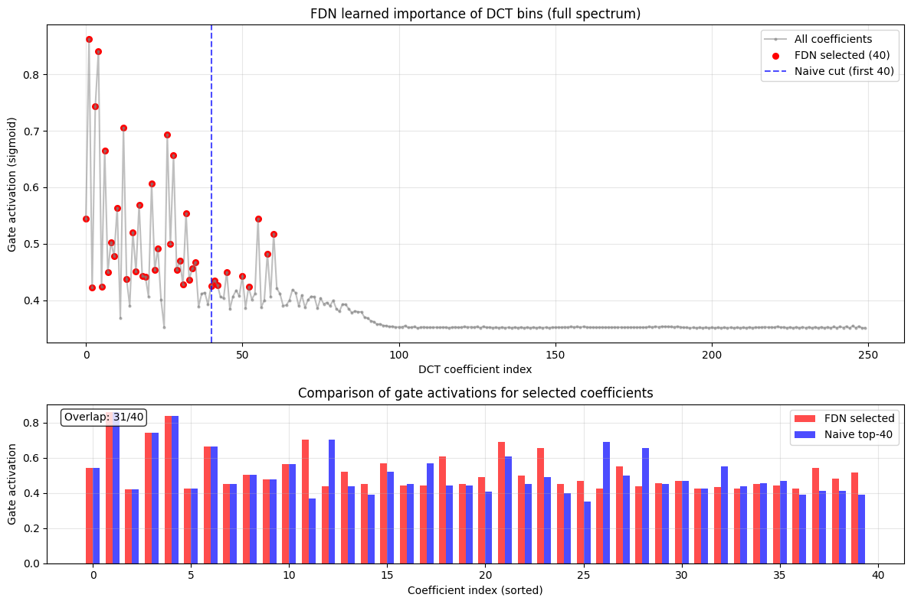

---

## Derived 40-DCT Feature Dataset

The 40 DCT coefficients selected through FDN were exported as a derived feature dataset for convenient access and reuse.

**Kaggle:** [MIT-BIH FDN-40DCT](https://www.kaggle.com/datasets/mahmudul28/mit-bih-fdn-40dct)

The dataset contains three exported CSV files:

| File                       | Description                          |
| -------------------------- | ------------------------------------ |
| `ds1_frozen_40dct.csv`     | 40-DCT features from DS1             |
| `ds2_frozen_40dct.csv`     | 40-DCT features from DS2             |
| `ds1_ds2_frozen_40dct.csv` | Combined DS1 and DS2 40-DCT features |

The files contain the extracted 40-DCT representation together with the corresponding class labels, patient identifiers, and dataset information.

These files are **derived feature data** and do not contain the original MIT-BIH recordings.

---

# Models

Three primary configurations are evaluated.

## Baseline

The baseline uses a 1D-CNN backbone with a fixed selection of the first 40 DCT bins.

This configuration provides a reference for comparison with the FDN-selected representation.

---

## LDN — Lightweight Deployment Network

LDN uses the **40 DCT coefficients selected through FDN** as its spectral input representation.

The model is designed around the compact feature representation and is exported to ONNX for deployment experiments.

---

## SASA-Net — Sample-Adaptive Spectral Attention

SASA-Net extends the compact spectral representation with **Sample-Adaptive Spectral Attention**.

The attention gate produces beat-dependent spectral weighting rather than applying identical weighting to every input.

RR-related features are used to condition the attention mechanism.

```text
40 FDN-selected DCT coefficients
                │
                ├────────────────┐
                │                │
                │           RR features
                │                │
                │                ▼
                │       Spectral attention
                │                │
                └───────► Adaptive weighting
                                 │
                                 ▼
                            Classifier
```

The model therefore combines the 40-coefficient spectral representation with sample-dependent spectral weighting.

---

# Main Results — AAMI 5-Class

The primary results use the strict **DS1 → DS2 inter-patient protocol**.

### Five-Seed Results

| Model                |        Accuracy |            Macro-F1 |
| -------------------- | --------------: | ------------------: |
| Baseline             |          0.8700 |     0.3760 ± 0.0446 |
| LDN (FP32)           | 0.8572 ± 0.0156 | **0.4069 ± 0.0287** |
| SASA-Net (FP32)      | 0.8210 ± 0.0504 |     0.3910 ± 0.0251 |
| LDN (INT8 ONNX)      | 0.8592 ± 0.0159 | **0.4079 ± 0.0290** |
| SASA-Net (INT8 ONNX) | 0.8199 ± 0.0519 |     0.3928 ± 0.0259 |

For the reported 5-class experiments, LDN gives the highest Macro-F1 among the listed configurations.

The INT8 LDN result is close to the corresponding FP32 result in the reported evaluation.

---

## 5-Class Confusion Matrices

### AAMI 5-Class

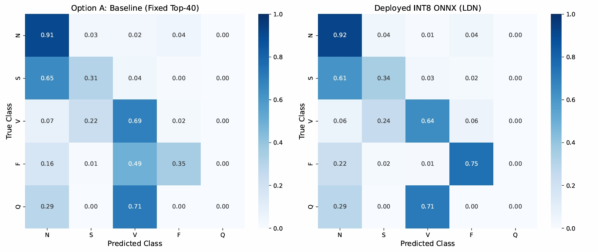

### LDN vs SASA-Net

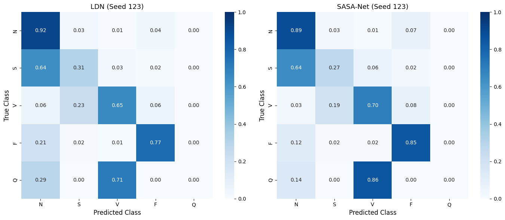

### Model Comparison

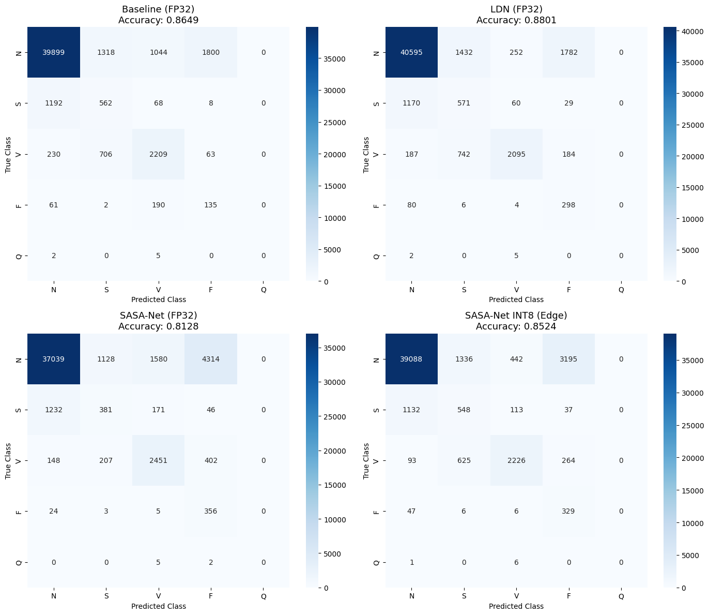

The confusion matrices show the class-wise distribution of predictions, including the stronger imbalance between the majority and minority classes.

---

# Model Size and Deployment

The trained models are exported to **ONNX** and quantized to **INT8** for compact deployment.

### Reported INT8 Model Sizes

| Model    | Format    |         Size |
| -------- | --------- | -----------: |
| LDN      | INT8 ONNX | **44.30 KB** |
| SASA-Net | INT8 ONNX | **48.26 KB** |

Both reported INT8 models remain below the **50 KB** target.

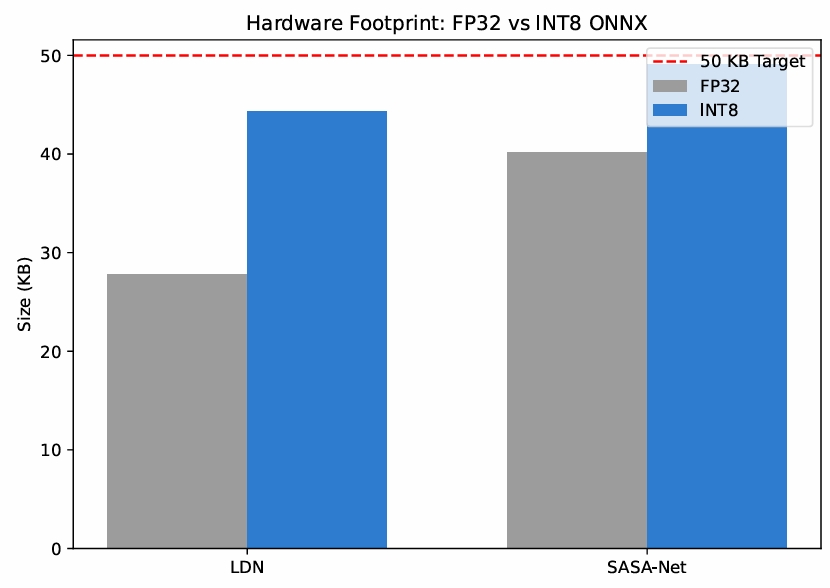

---

## FP32 vs INT8

Quantization is evaluated by comparing the FP32 and INT8 model behavior in addition to the reduction in model size.

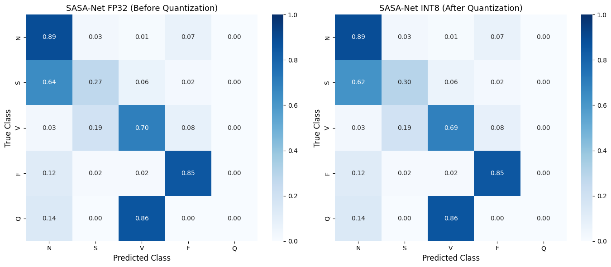

### INT8 Confusion Matrix

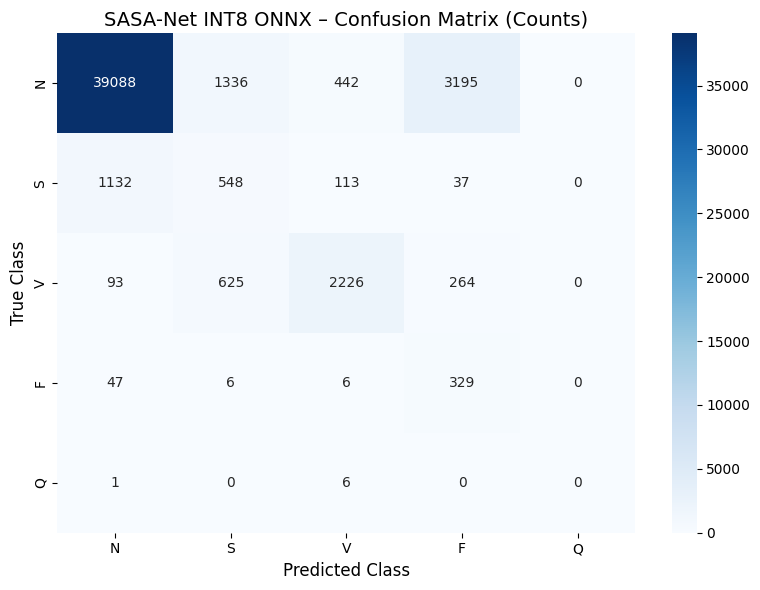

Z-score normalization is folded directly into the inference graph so that the normalization operation does not require a separate runtime stage.

---

# 3-Class Analysis

A separate 3-class configuration is evaluated alongside the primary 5-class task.

| Model    | Accuracy |   Macro-F1 |
| -------- | -------: | ---------: |
| Baseline |   0.9010 |     0.5990 |
| LDN      |   0.9080 |     0.6486 |
| SASA-Net |   0.9000 | **0.6487** |

### 3-Class Confusion Matrix

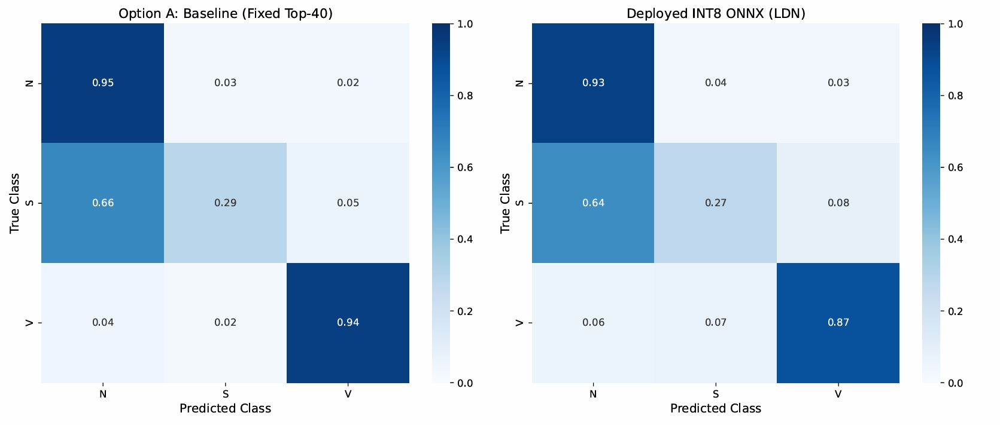

---

# 4-Class Analysis

The 4-class configuration provides an intermediate classification setting between the 3-class and 5-class evaluations.

| Model    |   Accuracy |   Macro-F1 |
| -------- | ---------: | ---------: |
| Baseline |     0.8950 |     0.4248 |
| LDN      |     0.9070 |     0.4736 |
| SASA-Net | **0.9180** | **0.4951** |

### 4-Class Confusion Matrix

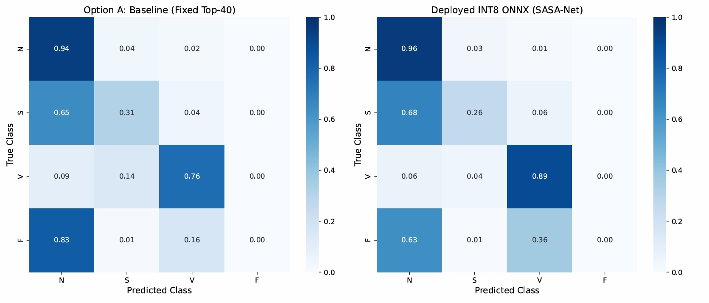

---

# Cross-Database Evaluation

Cross-database experiments evaluate the models on ECG data outside the primary MIT-BIH DS2 test set.

The evaluated databases include:

* **INCART**
* **European ST-T Database (EDB)**

## INCART

| Model                |   Accuracy | Macro-F1 |
| -------------------- | ---------: | -------: |
| LDN (FP32)           | **94.26%** |   0.4334 |
| SASA-Net (FP32)      |     88.02% |   0.4284 |
| SASA-Net (INT8 ONNX) |     80.25% |   0.3802 |

### Cross-Database Macro-F1

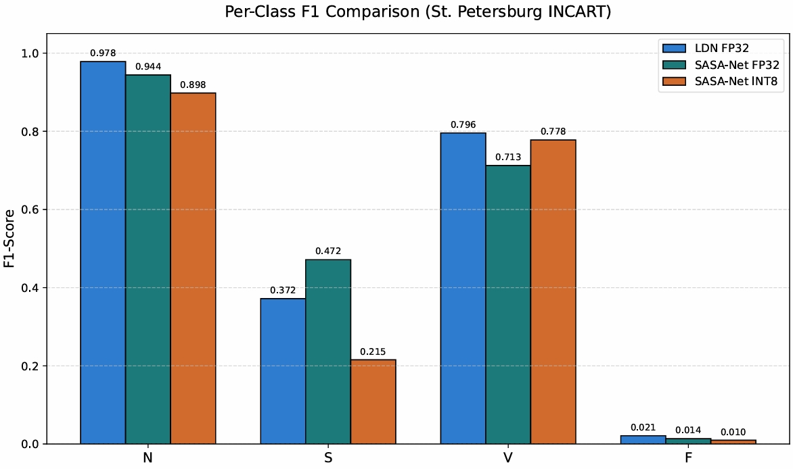

### INCART Per-Class F1

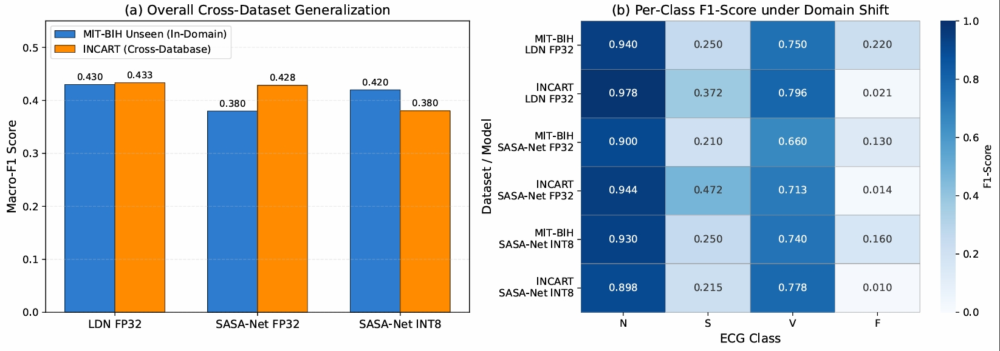

### Classwise Cross-Database Performance

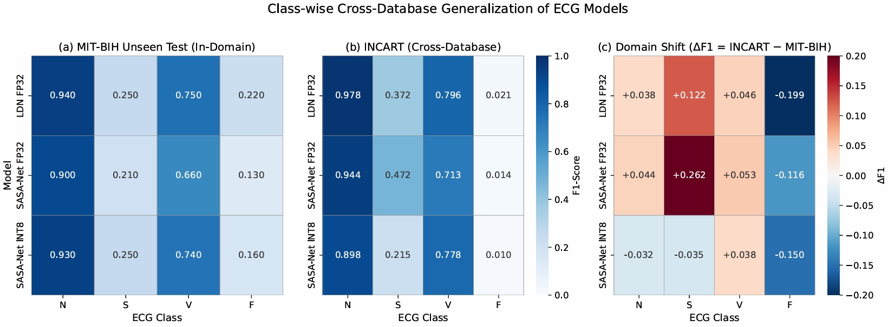

---

## European ST-T Database

| Model                | Accuracy | Macro-F1 |
| -------------------- | -------: | -------: |
| LDN (FP32)           |   72.60% |   0.2055 |
| SASA-Net (FP32)      |   80.55% |   0.1949 |
| SASA-Net (INT8 ONNX) |   80.65% |   0.1980 |

The European ST-T evaluation uses inferior limb leads. The minority-class distribution is substantially different, with minority classes accounting for less than 0.07% of the evaluated samples. This results in reduced minority-class performance and lower Macro-F1 values.

---

# Multi-Seed Evaluation

The primary experiments are repeated across multiple training seeds to examine variation in model performance.

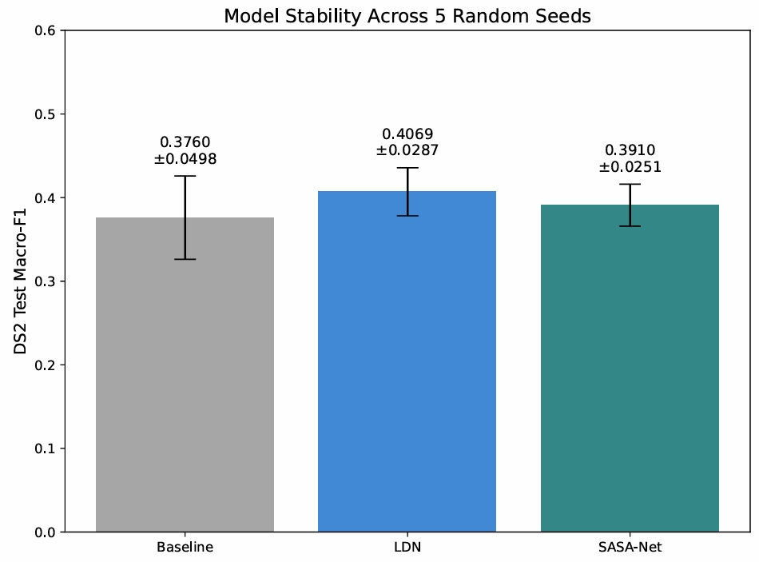

The primary results are reported as mean ± standard deviation for the repeated experiments.

---

# Robustness Analysis

Additional analyses examine classification behavior beyond overall Accuracy and Macro-F1.

### ROC and Precision-Recall

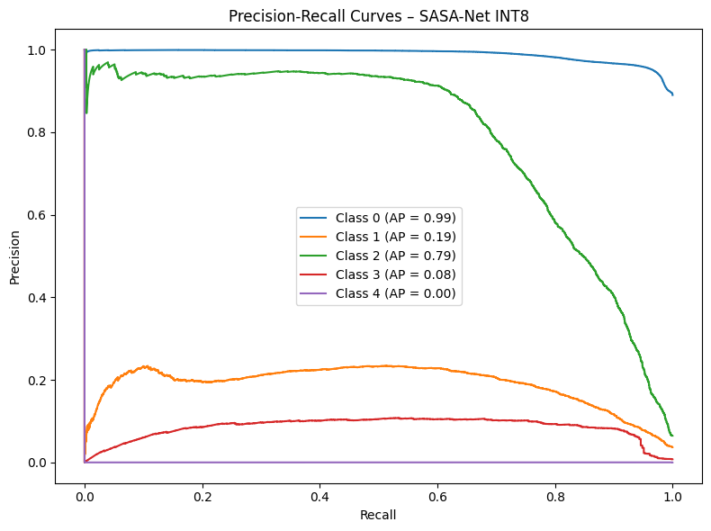

### Per-Patient Performance

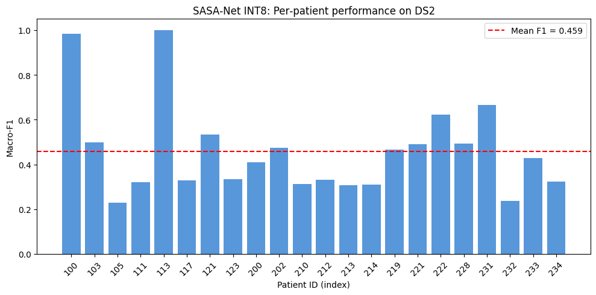

---

# Ablation Studies

Several configurations were evaluated during the development of the final experimental setup.

| Configuration           | Best Macro-F1 / Result | Observation                                                                                      |
| ----------------------- | ---------------------: | ------------------------------------------------------------------------------------------------ |
| FDN                     |                 0.3847 | Learnable frequency selection was used to identify the compact 40-bin representation             |
| Extended Budget         |                 0.3852 | Increasing the representation to 49 bins did not provide a statistically significant improvement |
| Two-Stage Cascade       |                 0.3827 | Binary N-vs-Ectopic followed by a 4-way split provided no additive gain                          |
| SASA-Cascade            |                 0.3881 | Combining the cascade with SASA did not improve over the individual components                   |
| Contrastive Pretraining |                 0.1830 | The tested configuration did not produce a useful embedding space                                |
| PhySASA-Net             |                ~0.4200 | RR regularization affected the representation of F-class features                                |
| Deep SASA (SE-ResNet)   |                 0.3500 | The larger network showed overfitting to augmented minority samples                              |
| Multi-Domain SASA       |                 0.3500 | Additional WPD features were redundant with DCT and caused ONNX issues                           |
| ResGate                 |                <0.4000 | Residual MLP gating reduced the sharpness of the learned gate output                             |
| Random Split            |                  0.620 | Evaluated separately to examine the effect of patient-level leakage                              |

---

# Comparison with Reported Results

The following comparison places the primary results alongside selected reported configurations.

| Reference / Model                             | Accuracy | Macro-F1 | Model Size |
| --------------------------------------------- | -------: | -------: | ---------: |
| de Chazal et al. (2004) — Linear Discriminant |   86.24% |       NR |        N/A |
| Zhang et al. (2021) — Adversarial CNN         |       NR |       NR |         NR |
| Wu et al. (2022) — DNN Ensemble + Focal Loss  |   91.89% |   49.95% |         NR |
| Elgazzar (2026) — Lightweight 1D-CNN          |   82.81% |   38.23% |     1.5 MB |
| LDN                                           |   85.40% |   0.4069 |   44.26 KB |
| SASA-Net                                      |   85.00% |   0.3910 |   48.26 KB |

Direct comparison across studies depends on the dataset split, class mapping, preprocessing, evaluation protocol, and other experimental settings. The primary evaluation here uses the strict **DS1 → DS2 inter-patient protocol**.

---

# Repository Structure

```text
SASA-Net-ECG/
│
├── data/
│   └── Processed datasets and feature representations
│
├── figures/
│   ├── classification/
│   │   ├── confusion_matrix_3class.png
│   │   ├── confusion_matrix_4class.png
│   │   └── confusion_matrix_5class.png
│   │
│   ├── cross_database/
│   │   ├── classwise_cross_database_generalization.png
│   │   ├── cross_database_macro_f1.png
│   │   └── per_class_f1_incart.png
│   │
│   ├── feature_discovery/
│   │   └── fdn_discovery_vs_naive_40.png
│   │
│   ├── model_comparison/
│   │   ├── four_model_confusion_matrices.png
│   │   ├── ldn_vs_sasa_confusion_matrices.png
│   │   ├── model_size_comparison.png
│   │   └── multi_seed_performance.png
│   │
│   ├── quantization/
│   │   ├── fp32_vs_int8_confusion_matrix.png
│   │   ├── int8_confusion_matrix_counts.png
│   │   └── model_size_comparison.png
│   │
│   ├── robustness/
│   │   ├── ROC_PR.png
│   │   └── per_patient_performance.png
│   │
│   └── signal_processing/
│       ├── best_heartbeat_segmentation.png
│       ├── one_patient_ecg_signal.png
│       ├── raw_ecg_vs_dct_bandpass.png
│       └── single_beat_NSVFQ_visualization.png
│
├── models/
│   └── Trained and exported model artifacts
│
├── results/
│   ├── 3_classes/
│   │   └── results.csv
│   ├── 4_classes/
│   │   └── results.csv
│   ├── 5_classes/
│   │   └── results.csv
│   └── cross_dataset/
│       ├── results.csv
│       └── New Microsoft Excel Worksheet.xlsx
│
├── LICENSE
└── README.md
```

---

# Experimental Configuration

| Component               | Configuration                    |
| ----------------------- | -------------------------------- |
| Dataset                 | MIT-BIH Arrhythmia Database      |
| Lead                    | MLII                             |
| Sampling rate           | 360 Hz                           |
| Beat window             | 250 samples                      |
| Window position         | −90 / +160 samples around R-peak |
| Bandpass                | 0.5–40 Hz                        |
| Bandpass order          | 3                                |
| Notch filter            | 60 Hz, Q = 30                    |
| Classification          | AAMI 5-class                     |
| Primary split           | DS1 → DS2                        |
| Evaluation              | Inter-patient                    |
| Spectral representation | DCT                              |
| Selected coefficients   | 40                               |
| Frequency selection     | FDN                              |
| Loss                    | Focal Loss                       |
| Class weighting         | Inverse square-root frequency    |
| SMOTE                   | Not used                         |
| Minority augmentation   | Gaussian-noise duplication       |
| Deployment format       | ONNX                             |
| Quantization            | INT8                             |
| LDN size                | 44.30 KB                         |
| SASA-Net size           | 48.26 KB                         |

---

# Main Findings

* The primary evaluation uses a **patient-independent DS1 → DS2 split**.
* The main classification setting contains the five AAMI classes: **N, S, V, F, and Q**.
* DCT is used to obtain a compact spectral representation of the ECG beats.
* FDN selects **40 DCT coefficients** for the lightweight models.
* LDN achieves a reported **Macro-F1 of 0.4069 ± 0.0287** in FP32 on the primary 5-class evaluation.
* LDN in INT8 ONNX achieves **0.4079 ± 0.0290 Macro-F1** in the reported evaluation.
* The reported INT8 model sizes are **44.30 KB for LDN** and **48.26 KB for SASA-Net**.
* The 3-class and 4-class settings provide additional comparisons between the baseline, LDN, and SASA-Net configurations.
* Cross-database experiments show different performance levels across INCART and European ST-T.
* The ablation experiments evaluate alternative frequency selection, larger feature budgets, cascaded classifiers, deeper architectures, additional feature domains, and other attention configurations.

---

# Reproducibility

The repository separates processed data, model artifacts, experimental results, and generated figures:

```text
data/      → processed data and feature representations
models/    → trained and exported models
results/   → numerical experiment results
figures/   → experiment visualizations
```

The numerical results are stored under [`results/`](results/), while the corresponding visualizations are organized under [`figures/`](figures/).

The derived 40-DCT feature dataset is also available on Kaggle:

**[MIT-BIH FDN-40DCT](https://www.kaggle.com/datasets/mahmudul28/mit-bih-fdn-40dct)**

---

